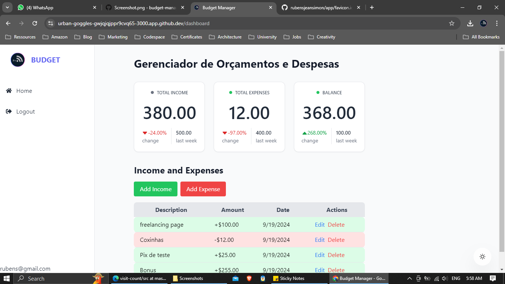
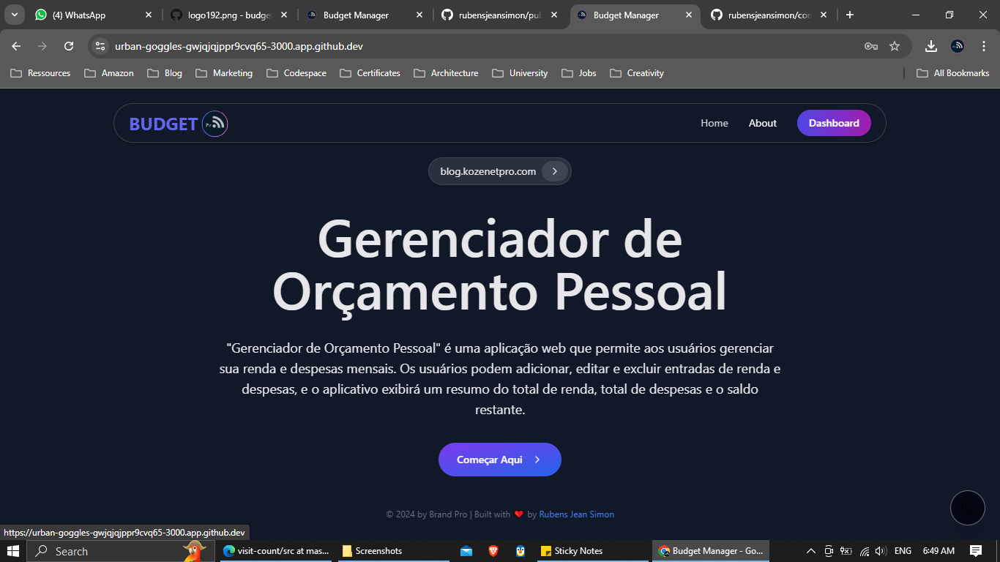
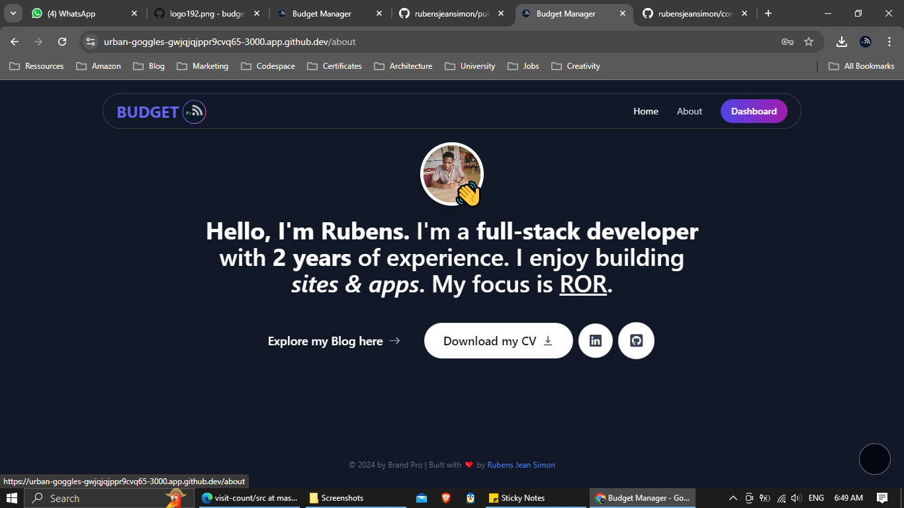

## Gerenciador de Orçamento Pessoal
"Gerenciador de Orçamento Pessoal" é uma aplicação web que permite aos usuários gerenciar sua renda e despesas mensais. Os usuários podem adicionar, editar e excluir entradas de renda e despesas, e o aplicativo exibirá um resumo do total de renda, total de despesas e o saldo restante.

## Funcionalidades

- **Gerenciamento de Renda e Despesas**: Adicione, edite e exclua entradas de renda e despesas.
- **Resumo Financeiro**: Veja um resumo do total de renda, total de despesas e o saldo restante.
- **Gráficos**: Visualize gráficos das somatórias dos valores.
- **Autenticação**: Faça login com conta Google ou com email e senha.

## Páginas

- **/dashboard**: Onde o usuário verá as somatórias dos valores com gráficos.
- **/home**: Onde o usuário verá uma explicação sobre o que o site é e como funciona.
- **/sobre**: Onde o usuário poderá ver informações sobre quem criou o site.
- **/login**: Onde o usuário poderá fazer login com conta Google ou com email e senha.

## Componentes

- **Receitas**: Componente para entrada de renda.
- **Despesas**: Componente para entrada de despesas.

## Armazenamento de Dados

Será necessário armazenar as receitas e despesas de cada usuário que a plataforma receber.

## Tecnologias Utilizadas

- **React**: Biblioteca JavaScript para construção de interfaces de usuário.
- **React Router**: Biblioteca para roteamento em aplicações React.
- **React Helmet**: Biblioteca para gerenciar o documento head.
- **Context API**: Para gerenciamento de estado global.
- **Local Storage**: Para armazenamento de dados no navegador.
- **Tailwind CSS**: Framework CSS para estilização.
- **react-hot-toast**: Biblioteca para notificações.
- **preline ui**: Biblioteca de componentes UI para React.